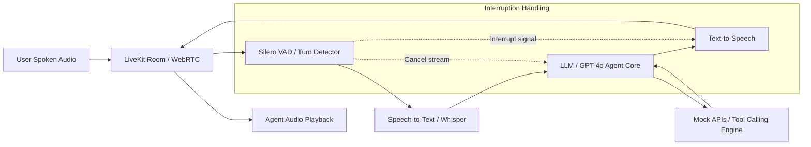

# Samsung Gen AI Hackathon 3.0: Interruptible Real-Time Agent

> **Theme 05:** Interruptible Real-Time Agents  
> **Evaluation Benchmark:** [Full-Duplex-Bench v3 (FDB-v3)](https://github.com/DanielLin94144/Full-Duplex-Bench)  
> **Framework:** LiveKit Voice Agents SDK

---

## 1. Overview

This project implements an interruptible, low-latency, full-duplex conversational voice agent evaluated on the **Full-Duplex-Bench v3 (FDB-v3)** multi-step tool-calling benchmark. The agent is designed to handle spontaneous human speech, natural disfluencies (e.g., self-corrections, hesitations, filler words), and immediate mid-utterance interruptions, while coordinating reliable multi-step tool invocations.

---

## 2. Architecture



The system employs either a **cascaded pipeline** (VAD + STT + Tool-calling LLM + TTS) or a **native real-time end-to-end model** via the LiveKit Agents framework:
- **Transport & Audio Streaming:** LiveKit Cloud WebRTC for sub-100ms real-time audio transport.
- **Voice Activity Detection (VAD):** Low-latency speech boundary and interruption detection.
- **LLM Reasoning & Function Execution:** Multi-turn tool calling with argument resolution.
- **Speech Synthesis:** Streaming TTS with instantaneous interruption cutoff upon user barge-in.

---

## 3. Setup

### Prerequisites
- **Python:** `3.10` (required for Full-Duplex-Bench v3 and PyTorch/NeMo compatibility)
- **FFmpeg:** Installed and added to system `PATH`
- **Git**

### Installation

1. **Clone the repository:**
   ```bash
   git clone <repo-url>
   cd Samsung_2
   ```

2. **Activate the Python 3.10 virtual environment:**
   ```bash
   # Windows PowerShell
   .\venv\Scripts\Activate.ps1

   # Linux / macOS
   source venv/bin/activate
   ```

3. **Install dependencies:**
   ```bash
   pip install --upgrade pip
   pip install "livekit-agents[openai,google,xai]~=1.3" "livekit-plugins-silero" "livekit-plugins-openai" "livekit[crypto]~=1.0" numpy pydub ffmpeg-python openai python-dotenv
   ```

4. **Configure Environment Variables:**
   Copy `.env.example` to `.env` and fill in credentials:
   ```bash
   cp .env.example .env
   ```

---

## 4. One-Command Reproduction

Run the end-to-end evaluation pipeline with a single command:

```bash
# Windows PowerShell
.\scripts\run_eval.ps1

# Linux / Bash
./scripts/run_eval.sh
```

This script:
1. Validates environment configuration and credentials.
2. Boots the LiveKit agent worker in the background.
3. Streams benchmark evaluation audio from the FDB-v3 dataset through the LiveKit room.
4. Executes the evaluation scripts for tool accuracy (F1), pass rate, and latency analysis.

---

## 5. Results

| Metric | Target / Baseline | Our Agent | Notes |
| :--- | :--- | :--- | :--- |
| **Tool Calling F1 Score** | TBD | TBD | Evaluated across 79 scenarios |
| **Binary Pass Rate** | TBD | TBD | Complete scenario goal satisfaction |
| **Time to First Tool Call (TTFT)** | TBD | TBD | Fine-grained tool invocation latency |
| **Interruption Recovery Latency** | TBD | TBD | Time to halt TTS on user speech |

*(Detailed metric tables and benchmark outputs will be populated upon benchmark completion).*

---

## 6. Extension Use Case

### Enterprise Customer Support with Seamless Human-in-the-Loop Handover
Beyond the standard 4 domains of FDB-v3 (ecommerce, finance, housing, travel), our architecture extends to **high-stakes enterprise workflows**:
- **Continuous Barge-In:** Enables natural user correction (e.g., *"No wait, cancel that ticket, check my flight instead"*) without queueing stale tool requests.
- **Context-Aware Disfluency Filtering:** Discriminated filler utterances (*"um"*, *"hold on"*) from intentional cancellation commands.
- **Transactional Safety:** Idempotent tool invocation guardrails that confirm side-effects before final execution.

---

## 7. API Keys Needed

To run and evaluate the agent, acquire and configure the following keys in `.env`:
- **LiveKit Cloud:** `LIVEKIT_URL`, `LIVEKIT_API_KEY`, `LIVEKIT_API_SECRET` ([LiveKit Console](https://cloud.livekit.io))
- **OpenAI:** `OPENAI_API_KEY` ([OpenAI Platform](https://platform.openai.com/api-keys)) - for GPT-4o LLM, Whisper STT, TTS, and the evaluation judge model.
- *(Optional)* **Google Gemini / Deepgram / Cartesia:** Additional provider keys if benchmarking alternative pipeline plugins.

---

## 8. Models / Providers Used (With Citations)

- **LiveKit Agents:**
  > LiveKit. *LiveKit Agents: Framework for real-time multimodal AI*. (2024). https://github.com/livekit/agents
- **Full-Duplex-Bench (FDB-v3):**
  > Lin, D., et al. *Full-Duplex-Bench: Evaluating Full-Duplex Spoken Dialogue Systems in the Era of Large Language Models*. National Taiwan University (NTU) & NVIDIA (2024). https://github.com/DanielLin94144/Full-Duplex-Bench
- **OpenAI GPT-4o & Whisper:**
  > OpenAI. *GPT-4o System Card & Whisper Speech Recognition*. (2024). https://openai.com
- **Silero VAD:**
  > Silero Team. *Silero VAD: pre-trained enterprise-grade Voice Activity Detector*. (2021). https://github.com/snakers4/silero-vad
