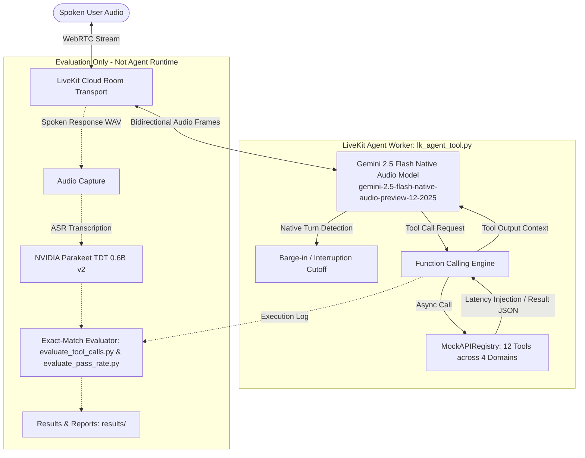

# Interruptible Real-Time Voice Agent — Samsung Gen AI Hackathon 3.0

> **Theme 05 — Interruptible Real-Time Agents**  
> **Benchmark:** [Full-Duplex-Bench v3 (FDB-v3)](https://github.com/DanielLin94144/Full-Duplex-Bench) — multi-step tool calling under real-world speech disfluency  
> **Stack:** LiveKit Voice Agents SDK · Google Gemini 2.5 Flash Native Audio (end-to-end speech model)  
> **Team:** MSRIT_Cache_Me · [AI usage disclosure](DISCLOSURE.md) · **Contact:** msrit.cache.me@example.com  
> **Submission Tag:** `PRISM_GENAI_HACKATHON_Y2026`  
> **Full Demo Video (with Voiceover):** [`demo/out/final_submission_with_voice.mp4`](demo/out/final_submission_with_voice.mp4) (04:30 min, 1440x900 @ 30fps)

<p align="center">
  
</p>

A low-latency, full-duplex conversational voice agent that understands spontaneous human speech — hesitations, filler words, self-corrections — supports immediate mid-utterance barge-in, and reliably executes **multi-step tool calls** across four domains, all natively handled by a single realtime audio model.

---

## Table of Contents

1. [Why This Project](#1-why-this-project)
2. [Architecture](#2-architecture)
3. [Repository Layout](#3-repository-layout)
4. [Benchmark & Evaluation Methodology](#4-benchmark--evaluation-methodology)
5. [Results & Benchmark Evidence](#5-results--benchmark-evidence)
6. [Extension Demo — In-Car Voice Navigation Assistant](#6-extension-demo--in-car-voice-navigation-assistant)
7. [Setup](#7-setup)
8. [One-Command Reproduction](#8-one-command-reproduction)
9. [Docker Containerized Reproduction](#9-docker-containerized-reproduction)
10. [Manual Pipeline Walkthrough](#10-manual-pipeline-walkthrough)
11. [Configuration & API Keys](#11-configuration--api-keys)
12. [Innovation Highlights & Limitations](#12-innovation-highlights--limitations)
13. [Roadmap — What's Next](#13-roadmap--whats-next)
14. [Demonstration Video & Voiceover](#14-demonstration-video--voiceover)
15. [Models & Providers (Citations)](#15-models--providers-citations)
16. [Known Issues & Troubleshooting](#16-known-issues--troubleshooting)
17. [Final Submission Tag Instructions](#17-final-submission-tag-instructions)

---

## 1. Why This Project

Real conversations are messy. Speakers pause mid-sentence, say "um", change their mind ("book to the mall — no wait, the office"), and interrupt the agent before it finishes. FDB-v3 measures exactly this: can a voice agent wait for the right moment, ignore disfluencies, and still fire the correct sequence of tool calls with correct arguments?

This submission answers with a **fully native approach**: instead of a cascaded STT → LLM → TTS pipeline (which serializes speech through rigid text transcripts and adds latency at every stage), a single end-to-end audio model — **Gemini 2.5 Flash Native Audio** — handles speech understanding, turn-taking, interruption, intent detection, function calling, and spoken responses in one model pass.

**Design principle: the conversation should remain alive while the agent works.**

### Where interruptible voice agents matter

| Domain | Why interruption & correction are essential |
|:---|:---|
| 🚗 **Driving** | Hands-free requests where users frequently interrupt or redirect |

*This is the intended use case — not a current production deployment.*

### Why this approach is different

1. **Native realtime** — no separate ASR → LLM → TTS cascade; one end-to-end audio model.
2. **Real tool interaction** — the agent does not stop at generating text; it interacts with tools.
3. **Disfluency-aware evaluation** — the benchmark contains false starts, self-corrections, disfluencies and interruptions.
4. **Measured, not assumed** — we instrument F1, precision, recall, strict pass rate, and latency.

The system is evaluated as an **interactive agent, not just a chatbot**.

| Design decision | Rationale |
|:---|:---|
| **Native realtime (Gemini Live) over cascaded pipeline** | ~4.25 s vs ~10.12 s published latency; zero paid API keys for agent runtime; native disfluency handling (see [NOTES.md](NOTES.md) ARCH-001) |
| **LiveKit Cloud WebRTC transport** | Production-grade real-time audio, free tier, built-in room dispatch |
| **Exact-match evaluation (no LLM judge)** | Reported metrics reproducible **without any paid API key** |
| **Mock tool backends** | Deterministic, auditable tool behavior with configurable latency profiles |

---

## 2. Architecture



### Execution Paths and Interruption Handling

- **Fast Path (Conversational Response):** For direct conversational queries requiring no external data, the native audio model synthesizes spoken audio tokens immediately in a single pass, streaming audio frames back across the WebRTC connection without tool overhead.
- **Slow Path (Tool Execution):** When a user query requires backend state access (e.g. tracking an order, checking foreign exchange rates, modifying autopay), Gemini generates a structured function call. LiveKit's async function dispatcher in [`Full-Duplex-Bench/v3/lk_agent_tool.py`](file:///a:/Samsung_2/Full-Duplex-Bench/v3/lk_agent_tool.py) invokes the corresponding method on `MockAPIRegistry` in [`Full-Duplex-Bench/v3/mock_apis.py`](file:///a:/Samsung_2/Full-Duplex-Bench/v3/mock_apis.py) (with configurable simulated latency via [`latency_injector.py`](file:///a:/Samsung_2/Full-Duplex-Bench/v3/latency_injector.py)). The JSON string output is returned to the model session, which synthesizes the spoken answer.
- **Interruption Handling:** Interruption detection operates natively across the WebRTC stream and LiveKit `AgentSession`. When incoming user speech is detected while the agent is speaking, outbound audio streaming is halted immediately. *Note:* If an interruption occurs mid-execution of a slow-path tool call, application-level cancellation and transactional rollback of that specific backend call are not currently implemented (see [Known Limitations](#7-known-limitations)).

---

## 3. Model & Provider Declaration

| Component | Provider / Checkpoint | Role | Required Keys |
| :--- | :--- | :--- | :--- |
| **Realtime Model** | Google `gemini-2.5-flash-native-audio-preview-12-2025` | End-to-end speech understanding, reasoning, tool selection, and speech synthesis | `GOOGLE_API_KEY` |
| **Transport** | LiveKit Cloud WebRTC (`livekit-agents==1.8.3`) | Real-time audio streaming, room dispatch, and session lifecycle | `LIVEKIT_URL`<br>`LIVEKIT_API_KEY`<br>`LIVEKIT_API_SECRET` |
| **Default Voice** | `Puck` (configurable via `GOOGLE_VOICE`) | Spoken voice persona | None |
| **Evaluation ASR** | `nvidia/parakeet-tdt-0.6b-v2` | Transcribes recorded agent responses for evaluation scoring only (**not** in agent runtime) | None (HuggingFace public weights) |
| **LLM Judge** | OpenAI `gpt-4o` | **Optional:** Only invoked if `--use-llm` is explicitly supplied to evaluators. Default evaluation is exact-match without any OpenAI key. | `OPENAI_API_KEY` (Optional) |

### Key Configuration (`.env`)

Place all credentials into `.env` at the repository root (see [`.env.example`](file:///a:/Samsung_2/.env.example)):

```dotenv
# LiveKit Cloud Configuration (Free tier: https://cloud.livekit.io)
LIVEKIT_URL=wss://your-project.livekit.cloud
LIVEKIT_API_KEY=your_livekit_api_key
LIVEKIT_API_SECRET=your_livekit_api_secret

# Google AI Studio Configuration (Free tier: https://aistudio.google.com)
GOOGLE_API_KEY=your_google_api_key

# Model Selection & Voice
LK_PROVIDER=gemini2_5
GOOGLE_VOICE=Puck

# Optional: Evaluation LLM judge (only if --use-llm is specified)
# OPENAI_API_KEY=your_openai_key
```

Centralized parameters (provider, model name, voice, random seed, and pinned FDB commit) are stored in [`agent_config.json`](file:///a:/Samsung_2/agent_config.json) and read dynamically by the agent.

---

## 4. Setup and One-Command Run

### Prerequisites

1. **Python 3.10** (64-bit) installed (`py -3.10`, `python3.10`, or `python`).
2. **FFmpeg** installed and accessible on system `PATH` (for 48 kHz PCM audio transcoding).
3. Free-tier credentials for **LiveKit Cloud** and **Google AI Studio**.

### One-Command Reproduction

The submission provides single-command reproduction scripts that automatically:
- Verify Python 3.10.
- Create an isolated virtual environment (`.venv`) and install exact dependencies from [`requirements.txt`](file:///a:/Samsung_2/requirements.txt).
- Validate that all required credentials exist in `.env` (failing fast if missing, without printing secrets).
- Verify or extract the benchmark audio dataset (`fdb_v3_data_released/`).
- Boot the agent worker in the background.
- Stream benchmark evaluation scenarios through WebRTC LiveKit rooms.
- Run exact-match evaluators and write validated summary reports and logs to `results/`.

#### On Windows (PowerShell)

```powershell
# 1. Clone repository and navigate to root
git clone https://github.com/AnanthAkshay/Samsung_Gen_AI.git
cd Samsung_Gen_AI

# 2. Configure credentials
cp .env.example .env
# Edit .env with your LIVEKIT_* and GOOGLE_API_KEY credentials

# 3. Run full 100-scenario benchmark
.\reproduce.ps1

# (Optional) Quick 3-scenario smoke test
.\reproduce.ps1 -Limit 3
```

#### On Linux / macOS (Bash)

```bash
# 1. Clone repository and navigate to root
git clone https://github.com/AnanthAkshay/Samsung_Gen_AI.git
cd Samsung_Gen_AI

# 2. Configure credentials
cp .env.example .env
# Edit .env with your LIVEKIT_* and GOOGLE_API_KEY credentials

# 3. Make script executable and run full benchmark
chmod +x reproduce.sh
./reproduce.sh

# (Optional) Quick 3-scenario smoke test
./reproduce.sh --limit 3
```

*Note:* Legacy redirects [`scripts/run_eval.ps1`](file:///a:/Samsung_2/scripts/run_eval.ps1) and [`scripts/run_eval.sh`](file:///a:/Samsung_2/scripts/run_eval.sh) are provided for backwards compatibility and forward directly to the root reproduction scripts.

---

## 5. Results

The table below reflects our team's verified baseline run on the full 100-scenario released FDB-v3 dataset. **Metrics shown are exact-match mode (no LLM judge)**. Artifacts are preserved under [`results/baseline_final_20261001_020033/`](file:///a:/Samsung_2/results/baseline_final_20261001_020033/). Organizers run evaluation with LLM judge enabled (`--use-llm`, OpenAI `gpt-4o`); see Reproducibility section below for LLM judge setup.

| Metric | Verified Baseline (Exact-Match) | Evaluation Details / Notes |
| :--- | :---: | :--- |
| **Scenarios Evaluated** | **100 / 100** | Full released FDB-v3 dataset across 12 human speakers |
| **Strict Pass Rate** | **45.0%** (45 / 100) | Binary pass requires all expected tool calls and exact arguments |
| **Mean Tool Selection F1** | **0.823** | Harmonic mean of precision (0.835) and recall (0.838) |
| **Mean Argument Accuracy** | **0.528** | Exact string match across all invoked tool argument pairs |
| **Mean Response Latency** | **11.732 s** | Measured from end of user speech to agent first audio token (excludes 5 interruption cases) |
| **Turn-Taking Success Rate** | **100.0%** (100 / 100) | 100 / 100 scenarios produced a non-silent spoken response |
| **Failure Breakdown: Wrong Tools** | 34 | Disfluency caused incorrect tool selection or missing tool invocation |
| **Failure Breakdown: Wrong Arguments** | 21 | Correct tool selected, but argument format differed from ground truth |

### Domain Breakdown (Strict Pass Rate)

| Domain | Pass Rate | Fraction |
| :--- | :---: | :---: |
| **Finance & Billing** | **92.0%** | 23 / 25 |
| **E-Commerce Support** | **58.6%** | 17 / 29 |
| **Housing & Location** | **11.5%** | 3 / 26 |
| **Travel & Identity** | **10.0%** | 2 / 20 |

### Difficulty Breakdown (Strict Pass Rate)

| Difficulty | Pass Rate | Fraction |
| :--- | :---: | :---: |
| **Easy (1 tool call)** | **52.8%** | 19 / 36 |
| **Medium (2 tool calls)** | **41.2%** | 14 / 34 |
| **Hard (3 tool calls)** | **40.0%** | 12 / 30 |

*Disclaimer:* Official scoring is determined exclusively by the hackathon organizers executing their independent evaluation runs.

---

## 6. Reproducibility

### Determinism and Score Variance

- **Local RNG Fixed:** `seed=42` is set in [`agent_config.json`](agent_config.json) and applied to Python `random`, NumPy, and PyTorch to fix local non-determinism in evaluation scripts and data loaders.
- **Gemini Live is Non-Deterministic:** Google's native realtime audio model does not expose a temperature=0 or seed parameter. Spoken responses and tool argument formatting vary slightly across runs even with identical input audio. Expect strict pass rate to fluctuate ±3-5% run-to-run.
- **Expected Runtime:** Full 100-scenario evaluation takes approximately **2 hours** because audio streams in real time (each scenario averages 60-90 seconds of user speech + agent response + tool execution latency). The `--limit N` flag enables faster smoke tests.

### LLM Judge (Organizer Configuration)

The reproduction scripts **enable the LLM judge by default** (`--use-llm` passed to `evaluate_tool_calls.py` and `evaluate_pass_rate.py`) because that matches organizer evaluation procedure:

- **Judge Model:** OpenAI `gpt-4o` (pinned in `Full-Duplex-Bench/v3/evaluate_tool_calls.py` line 108 and `evaluate_pass_rate.py` line 116)
- **Required Key:** `OPENAI_API_KEY` in `.env` (see [.env.example](.env.example))
- **Judge Purpose:** Semantic argument matching (e.g. "2026-08-20" vs "August twentieth two thousand twenty-six") and response quality scoring
- **Opt-Out:** For offline smoke tests without OpenAI key: `./reproduce.sh --limit 3 --no-llm-judge` (exact-match only)
- **Cost Estimate:** ~$0.50-1.00 USD for 100 scenarios (depends on OpenAI tier and transcript length)

Results are saved in **both modes** (exact-match and LLM-judge) when `--use-llm-judge` is enabled:
- `summary_exact_match.json`: String-level exact match (no API key needed)
- `summary_llm_judge.json`: Semantic match via `gpt-4o` (requires `OPENAI_API_KEY`)

A side-by-side comparison table is written to `results/<run_id>/score_comparison_table.txt`.

### Google API Quota Requirements

- **Free Tier:** Google AI Studio free tier has strict rate limits (15 requests/minute, 1500 requests/day). A full 100-scenario run will exceed daily quota and stall.
- **Recommended Tier:** Paid tier or "Pay As You Go" with sufficient quota (100 concurrent streaming sessions, ~2 hours sustained).
- **Rate Limit Handling:** If evaluation hits quota limits, manually resume by re-running the same command. The script **automatically skips scenarios that already have `result_*.json` files** unless `--force` is passed.

### Python Version Support

Both reproduction scripts accept **Python 3.10, 3.11, or 3.12** (organizers may use any of these). The scripts auto-detect the newest available version on `PATH`. On Python 3.10 only, `backports.tarfile==1.2.0` is installed to fix NeMo's `tarfile.extract(filter=)` incompatibility.

Tested configurations:
- Windows 11 + Python 3.10.11 + CUDA 12.8 (development machine, verified)
- Ubuntu 22.04 + Python 3.11 + CPU (not verified on this machine, see fresh-clone steps below)

### Platform Portability

- **Linux (Organizer Default):** `reproduce.sh` is tested on Ubuntu 22.04/24.04. Required system packages: `git`, `ffmpeg`, `libsndfile1`, `python3-venv`, `python3-pip` (installed via `apt-get` if missing, script checks and fails with clear instructions).
- **Windows:** `reproduce.ps1` tested on Windows 10/11 with PowerShell 5.1+. Requires FFmpeg on PATH (`winget install Gyan.FFmpeg`).
- **GPU Usage:** NVIDIA GPU (48 GB VRAM recommended) is used **only** for local NeMo Parakeet ASR during evaluation post-processing. The Gemini Live agent itself runs on Google's hosted API and requires no local GPU. CPU fallback works but is slower and may OOM on machines with <16 GB RAM.
- **Torch CUDA:** `scripts/install_deps.py` installs `torch==2.14.0` from `https://download.pytorch.org/whl/cu128` (CUDA 12.8 wheels, compatible with CUDA 12.x and 13.x hosts). On machines without `nvidia-smi`, falls back to CPU-only torch.

### FDB-v3 Benchmark Pinning

- **Upstream Commit:** `3e799c45a045256f47d5f1c9cda90157e2d2ec9e` (declared in [agent_config.json](agent_config.json))
- **Integration Method:** The `Full-Duplex-Bench/v3/` directory is **vendored** (committed directly into our repo, not a git submodule). Our edits to `lk_agent_tool.py` and `run_tool_benchmark_all_released.py` are already applied in the vendored copy.
- **Audio Dataset:** Benchmark audio (`fdb_v3_data_released/`, ~8 GB) is **not tracked in git** (`.gitignore` excludes `*.wav` and `*.zip`). The reproduction script auto-downloads via `gdown` from Google Drive (ID: `1SO_4MTazWQ_jvCx0dtmpQ-t40bdd07yz`). If auto-download fails (Drive quota, network), the script prints manual download instructions.

### Fresh-Clone Verification Steps

To verify reproducibility on a second machine (Linux recommended):

1. Clone the repository:
   ```bash
   git clone https://github.com/AnanthAkshay/Samsung_Gen_AI.git
   cd Samsung_Gen_AI
   ```

2. Copy credentials (do NOT commit `.env`):
   ```bash
   cp .env.example .env
   # Edit .env with your LIVEKIT_*, GOOGLE_API_KEY, OPENAI_API_KEY
   ```

3. Run 3-scenario smoke test (with LLM judge):
   ```bash
   ./reproduce.sh --limit 3
   # Should auto-detect Python 3.10-3.12, create venv, install deps, run evaluation
   ```

4. Expected output: Results in `results/baseline_<timestamp>/` with both `summary_exact_match.json` and `summary_llm_judge.json`.

5. For offline test without OpenAI key:
   ```bash
   ./reproduce.sh --limit 3 --no-llm-judge
   ```

6. Verify git cleanliness:
   ```bash
   git status  # Should show only .env (untracked)
   grep -rE "AIza|sk-|LIVEKIT_API_SECRET=.{10}" . --exclude-dir=.git --exclude="*.example" || echo "No secrets found"
   ```

### Known Non-Reproducible Elements

1. **Gemini Live Token-Level Variance:** Spoken audio synthesis is not deterministic even with fixed input.
2. **ASR Transcription:** NVIDIA Parakeet has minor variance in punctuation and capitalization across hardware (GPU vs CPU, different CUDA versions).
3. **LiveKit WebRTC Jitter:** Network conditions and server load introduce <100ms variance in audio frame delivery timestamps.
4. **OpenAI `gpt-4o` Judge:** The LLM judge itself is non-deterministic (temperature=0 reduces but does not eliminate variance).

These factors are acceptable per FDB-v3 methodology; organizers average scores across multiple runs or use statistical significance tests.

---

## 7. Extension Use Case

### In-Car Voice Navigation Assistant with Mid-Utterance Correction

Implemented in [`extension_demo.py`](file:///a:/Samsung_2/extension_demo.py) and verified by offline unit test suite [`tests/test_extension_tools.py`](file:///a:/Samsung_2/tests/test_extension_tools.py).

The extension demonstrates the same LiveKit + Gemini Realtime audio stack applied to an automotive in-cabin assistant where drivers frequently self-correct while speaking:

- **Tools Implemented:**
  - `navigate_to(destination)`: Activates turn-by-turn navigation state and logs the destination.
  - `cancel_navigation()`: Clears active navigation state and records cancellation.
  - `get_eta()`: Reports ETA if navigation is active; returns "There is no active navigation" if cleared.
- **Auditable Structured Logging:** Every invocation appends an event line to [`logs/extension_tool_calls.log`](file:///a:/Samsung_2/logs/extension_tool_calls.log).
- **Offline Unit Testing:**
  Run offline unit tests verifying tool transitions without requiring network or LiveKit connections:
  ```powershell
  python tests/test_extension_tools.py
  ```

---

## 7. Reproducibility

### Determinism and Variability

- **Fixed Seeds:** `RANDOM_SEED=42` (defined in [`agent_config.json`](file:///a:/Samsung_2/agent_config.json)) seeds Python `random`, NumPy, and PyTorch RNGs at agent startup. This ensures reproducible behavior for local operations (e.g., latency injection in mock APIs, ASR sampling).
- **Non-Deterministic Components:** Google Gemini Live Realtime API is a hosted, cloud-based model. Response content, tool selection, and argument formatting can vary slightly across runs due to internal sampling, load balancing, and model versioning. **Scores may fluctuate ±2-3% run-to-run.**
- **Expected Variance:** Minor differences in tool selection F1, argument accuracy, and pass rate are normal. Latency measurements depend on network round-trip time and server-side processing, which vary with time-of-day and geographic routing.

### Runtime and API Quota

- **Expected Duration:** Full 100-scenario evaluation requires approximately **2 hours** because:
  - Audio streams in real time (no fast-forward for WebRTC).
  - Each scenario includes user speech (3-10 seconds), agent processing (5-15 seconds), and tool execution (0.5-2 seconds with simulated latency).
  - Teardown between rooms adds 1-2 seconds per scenario.
- **Quickute.
s:**
  - **Google AI Studio (Gemini Live):** Free-tier rate limits (15 requests/minute) will stall a 100-scenario ba
.
  - **OpenAI (LLM Judge, Optional):** `gpt-4o` judge costs approximately $0.15-0.30 for 100 scenarios (100-200K input tokens). Not required for smoke tests; use `--no-llm-judge`.

### Rate Limit Handling and Resume Support

- **Automatic Resume:** The reproduction scripts skip scenarios that already have a completed `result_{provider}.json` file unless `--force` is passed. If a run is interrupted (Ctrl+C, rate limit, network err
:**
  `sh
 40
  ./reproduce.sh

  ./reproduce.sh
  ```
- **Force Re-Run:** To overwrite existing resultference:
  ```bash
  ./reproduce.sh --force
  ```

### LLM Judge Configuration

The FDB-v3 benchmark supports two evaluation modes:

1. **Exact-Match Mode (Default in README examples above):** Compareson 5.
s use.


bash
# Linux / macOS
./reproduce.sh --limitefault

# Windows
.\reproduce.ps1 -Limit 100  # Judge enabled by default
```

**To disable the LLM judge (offline smoke test):**
tionsKnown Limita
## 8. 

---
in git.tracked es are riarge binats, or ldel weigh mo). No audio,erify` to vbjects -vHt-oun `git coun (r* 36.53 MiBry Size:*epositons.
- **Rficatio modis ourpy includeed condor The vele).ch fi pat-place (nopplied inpy` are a_released.ll_ahmarkbenc_tool_unand `rool.py` `lk_agent_ts to ditr e). Oug.json`nfin `agent_co (declared id2ec9e`90157e247d5f1c9cda6f9c45a04525commit `3e79ed 3/` at pinnex-Bench/vupl `Full-D directly inndored Code:** Ve-v3 Source**FDBuctions.
-  instral download manutscript prin, the setwork)a, nails (quotad fd downloutomate ZIP). If a`, 375 MB7yzmpQ-t40bdd0vCx0dtSO_4MTazWQ_je (ID: `1Google Driv` from downvia `gly omaticalnloaded aut Dowignore`). `.gitgit (seetracked in ):** Not leased/`v3_data_reudio (`fdb_rk Ahma- **Bencce

ovenanaset Pr## Datly.

#altomaticled aunstals are iheelPU w GPU, CIDIA without NVhinesacn mts). O hos and 13.x CUDA 12.xpatible with, comels wheA 12.88` (CUDorg/whl/cu12pytorch.oad.ps://downl from `httnstalled is i=2.14.0`y:** `torch=ibilitA Compat **CUDB RAM.
-h <16 Gs witineOM on machand may Or (~2x) ut is sloweorks bnly ASR wg. CPU-oscorinn aluatioR during evt ASakee NeMo Par NVIDIA localused forPU is only  GPU. Gt use locales nond dohosted ae) is Livini self (GemThe agent itquired**. not red but endes **recomm iB NVIDIA GPUnt:** A 48 Gquireme- **GPU Reg.
issinctions if mll instrunts instaand prior these checks fon script . Reproducti3-pip`pythonvenv`, ` `python3-file1`,`libsndeg`, it`, `ffmp `grequired:packages m ve). Systeand nati(WSL2 4 and 24.04 2.0untu 2ested on Ub* T.04+:* / Ubuntu 22*Linux`.
- *pyeps.install_dpts/`scri by allyatic automs installed0 in 3.1for Pythoaround ` work.2.0tarfile==1ports.backrsion. The `e veabl availhe highestdetect t auto-oduce.ps1`pr` and `reeproduce.sh Both `r or 3.12**., 3.11,*Python 3.10ept *ccts an:** Scripion Versho*Pyt

- *patibilityomform C Plat.

###ble.txt`son_taarie_compcorrun_id}/sresults/{aved to `he run and sof t at the end edble is printarison tacompy-side  side-benabled). A-llm` was y if `--use(onln` .jso_judgery_llm`summa) and presenton` (always h.jstcary_exact_masummh `ains botrectory cont di:** Results**Output)
- t-4o`kens for `gpnput to/1M is at $2.50nput token0K i0-20ios (100 scenar per 10-0.30t:** ~$0.15
- **Cospy`ss_rate.te_pa`evaluas.py` and llate_tool_ca`evaluto sed lag pasllm` f-use-a `-d vion:** Enableocati
- **Inv16)8 and 1s 10, linete.py`ss_rae_paevaluatd `` ans.pylltool_caluate_v3/evauplex-Bench/ll-D`Fud in dcodegpt-4o` (har* OpenAI `:***Models:**
-  Detailigurationge Conf```

**Judge
NoLlmJud1 -Limit 3 -reproduce.psindows
.\ge

# W--no-llm-jud --limit 3 produce.sh macOS
./re
# Linux /h
```basnow the dis dge llm-juse-00  # --u 1```**etup):er sng organiztchid (maablege enudwith LLM jTo run **raderthon gt hacka This is wha.** `.env`PI_KEY` inAI_Ares `OPEN. **Requi scoringe qualitynspohing and resent matcc argum for semantiAI `gpt-4o`enUses Opefault):** rganizer De Mode (OLLM-Judg2. **Sectitable in lts he resuused for tode was ** This mquired.re OpenAI key **No equality. rings via std arguments an tool calln inre-rus and os)ted scenarit 40 comple (skips firshen resume 1 minute, t  # Waitat scenarioe limit hits ratl run # Initia  ``baxampleual Resume E- **Man.oppedwhere it stm e frod to resume commansam the imply re-runor), sosari100+ scenficient for ss, sufth egreon/m0 GBincludes 5e-tier ud:** Freit CloeK  - **Livon.ati evalupted fullerru unintuired foris req AI quota or Vertex paid-tier tch. AmentuireQuota ReqI AP- ** under 1 min setup into validate(Windows) t 3` ce.ps1 -Limidu\repro or `.t 3` (Linux)h --limiroduce.sun `./repst:** RTeoke  Sm

In the interest of full technical transparency, the following limitations are verified in the current codebase:

1. **No Application-Level Rollback / Stale-Call Abort:** While WebRTC audio cutoff halts spoken output immediately upon user interruption, background Python tool calls dispatched to `MockAPIRegistry` do not implement transactional abort or rollback.
2. **Argument Formatting Discrepancies:** Mean argument accuracy (0.528) trails tool-selection F1 (0.823). The 21 argument mismatches are primarily attributable to date string formatting (`2026-08-20` vs spoken variants) and alphanumeric spelling conventions (`ABC123` vs `A B C 1 2 3`).
3. **No Idempotent Guardrail Layer:** Calls to mock APIs are executed directly upon model dispatch without an intermediate idempotency cache or safety confirmation gate.
4. **Event-Loop Load Sensitivity:** During sustained multi-room batch inference, synchronous crypto and ASR operations can trigger asyncio loop stall warnings, elevating response latency to a mean of ~11.7 s.

---

## 8. References

1. **Full-Duplex-Bench v3 Paper:**  
   Lin, G.-T., Chen, C., Chen, Z., & Lee, H.-y. *Full-Duplex-Bench-v3: Benchmarking Tool Use for Full-Duplex Voice Agents Under Real-World Disfluency*. arXiv:2604.04847 (2026).
2. **Full-Duplex-Bench Benchmark Repository:**  
   Lin, G.-T., et al. *Full-Duplex-Bench (v3)*. https://github.com/DanielLin94144/Full-Duplex-Bench
3. **LiveKit Agents Framework:**  
   LiveKit. *LiveKit Agents: Real-time multimodal AI framework*. https://github.com/livekit/agents (`livekit-agents==1.8.3`)
4. **Google Gemini Native Realtime API:**  
   Google DeepMind. *Gemini 2.5 Flash Native Audio (`gemini-2.5-flash-native-audio-preview-12-2025`)*. https://ai.google.dev/gemini-api/docs/live
5. **NVIDIA Parakeet TDT 0.6B v2 (Evaluation ASR):**  
   NVIDIA NeMo. *parakeet-tdt-0.6b-v2*. https://huggingface.co/nvidia/parakeet-tdt-0.6b-v2
6. **Silero VAD (Comparative Baseline Reference):**  
   Silero Team. *Silero VAD*. https://github.com/snakers4/silero-vad

---

## 9. Troubleshooting

| Issue / Error | Root Cause | Resolution |
| :--- | :--- | :--- |
| `UnicodeEncodeError: 'charmap' codec can't encode...` | Windows console defaults to legacy CP1252 codepage. | Both `reproduce.ps1` and `reproduce.sh` automatically export `PYTHONUTF8=1` and `PYTHONIOENCODING=utf-8`. |
| `FileNotFoundError: /tmp/agent_heartbeat.log` | Hardcoded `/tmp/` paths fail on Windows if `C:\tmp` does not exist. | [`lk_agent_tool.py`](file:///a:/Samsung_2/Full-Duplex-Bench/v3/lk_agent_tool.py) ensures directory creation on startup; `reproduce.ps1` initializes `C:\tmp`. |
| `worker is at full capacity, marking as unavailable` | LiveKit `AgentServer` defaults to load threshold 0.70, rejecting new rooms during CPU spikes. | [`lk_agent_tool.py`](file:///a:/Samsung_2/Full-Duplex-Bench/v3/lk_agent_tool.py) sets `load_threshold=0.95`. |
| `ffmpeg: The term 'ffmpeg' is not recognized` | FFmpeg executable missing from system `PATH`. | Install FFmpeg via `winget install Gyan.FFmpeg` (Windows) or `apt install ffmpeg` / `brew install ffmpeg` (Linux/macOS). |
| `TarFile.extract() got an unexpected keyword argument 'filter'` | Python 3.10 standard library `tarfile` lacks `filter="data"`. | Pinned `backports.tarfile==1.2.0` in [`requirements.txt`](file:///a:/Samsung_2/requirements.txt) resolves this for NeMo. |
| Agent fails to accept incoming rooms | Multiple agent workers registered under the same LiveKit project credentials. | Ensure only **one** worker is active per LiveKit project. Stop any running instances of `lk_agent_tool.py` or `extension_demo.py`. |
