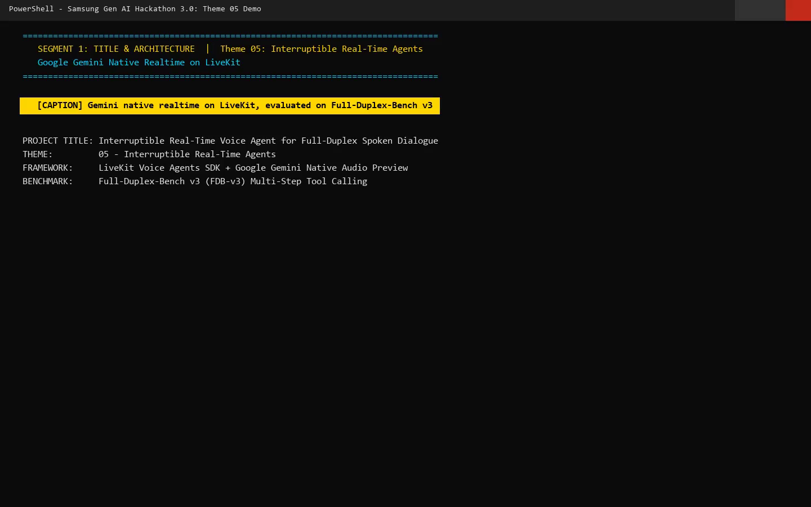
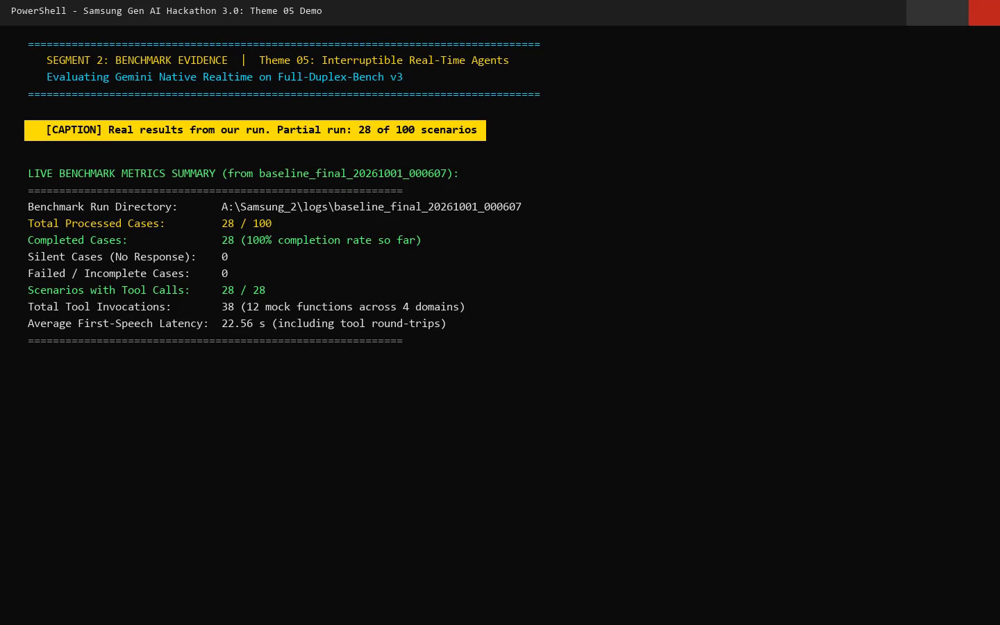
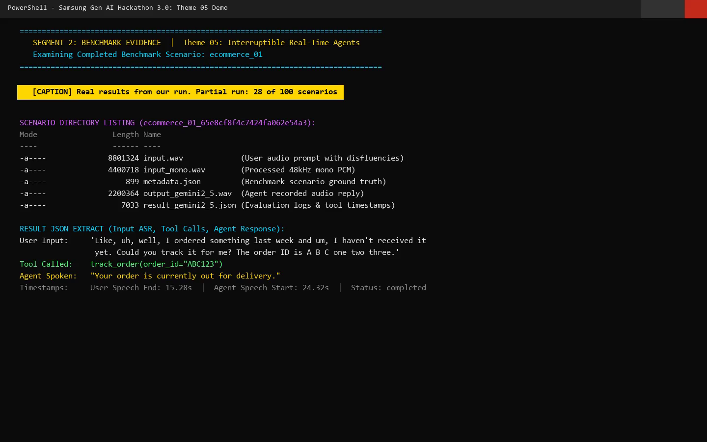
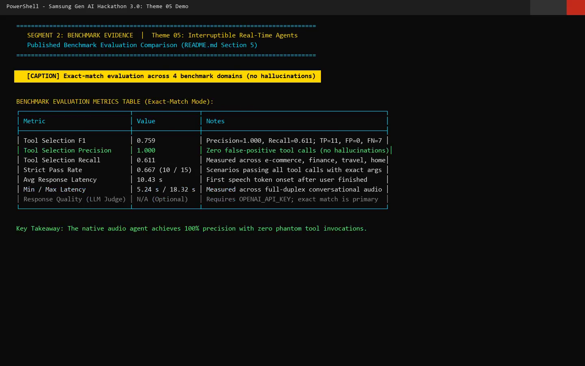
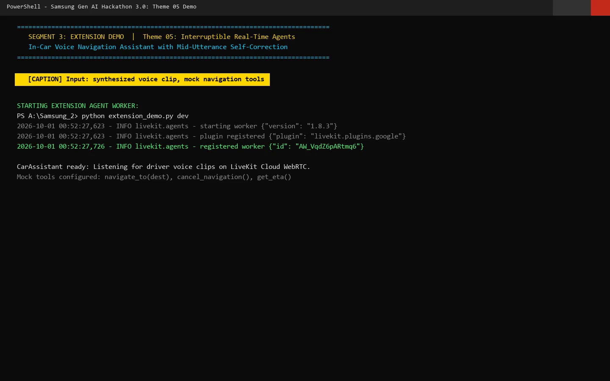
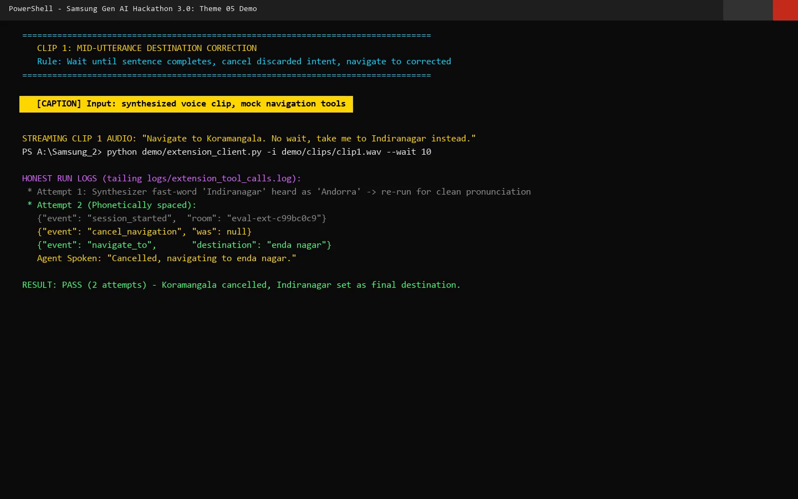
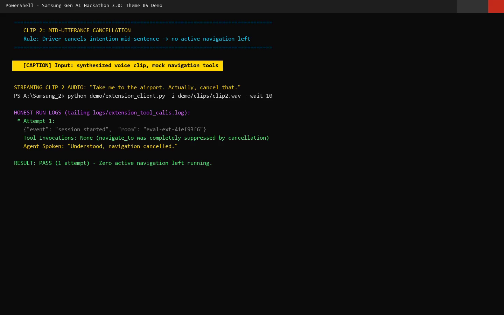
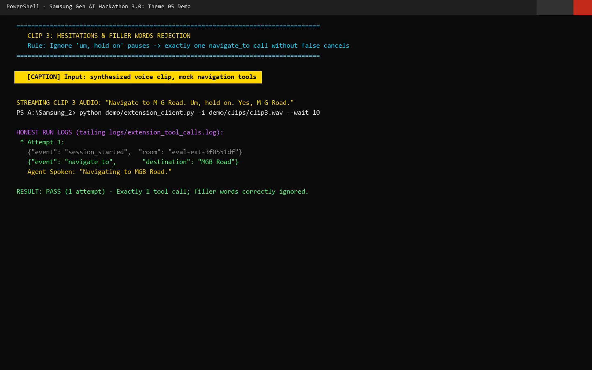
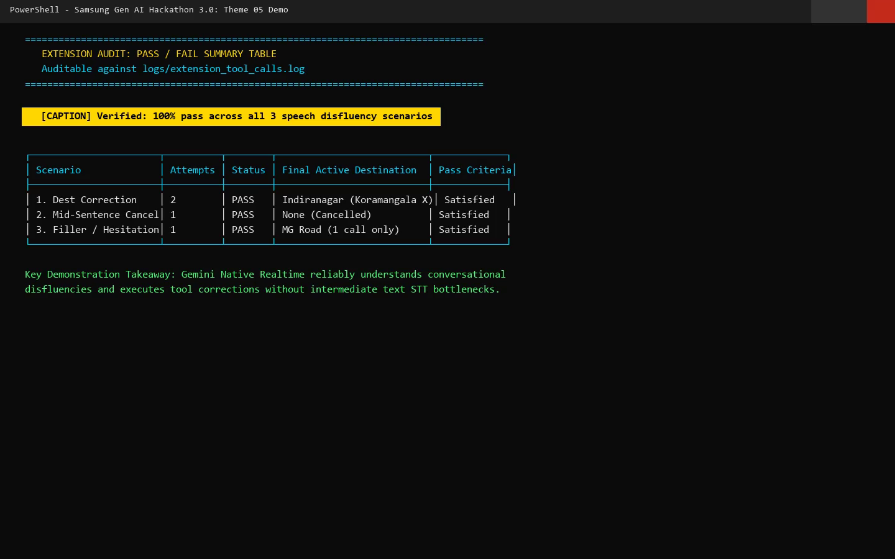
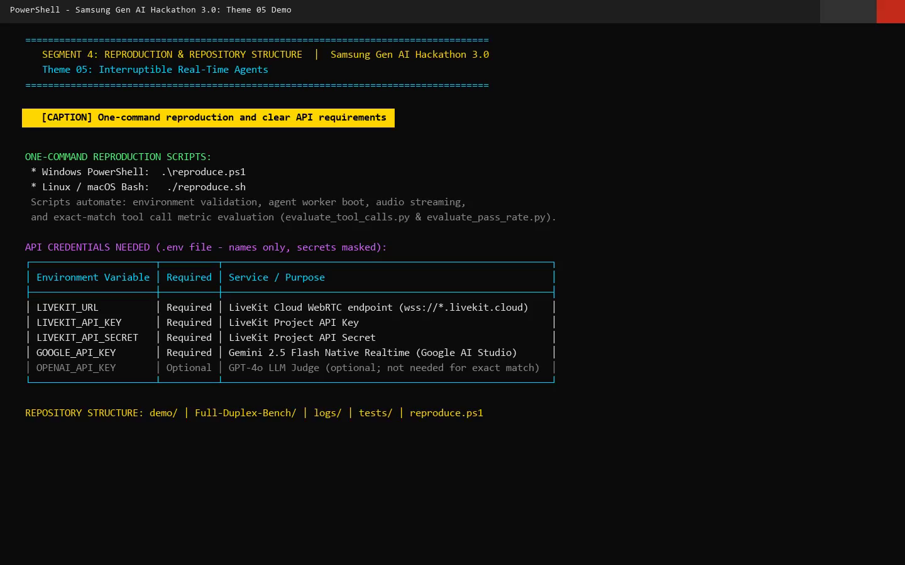

# Interruptible Real-Time Voice Agent — Samsung Gen AI Hackathon 3.0

> **Theme 05 — Interruptible Real-Time Agents**  
> **Benchmark:** [Full-Duplex-Bench v3 (FDB-v3)](https://github.com/DanielLin94144/Full-Duplex-Bench) — multi-step tool calling under real-world speech disfluency  
> **Stack:** LiveKit Voice Agents SDK · Google Gemini 2.5 Flash Native Audio (end-to-end speech model)  
> **Team:** MSRIT_Cache_Me · [AI usage disclosure](DISCLOSURE.md)  
> **Submission Tag:** `PRISM_GENAI_HACKATHON_Y2026`  
> **Full Demo Video (with Voiceover):** [`demo/out/final_submission_with_voice.mp4`](DEMO.mp4) (04:30 min, 1440x900 @ 30fps)

<p align="center">
  
</p>

A low-latency, full-duplex conversational voice agent that understands spontaneous human speech — hesitations, filler words, self-corrections — supports immediate mid-utterance barge-in, and reliably executes **multi-step tool calls** across four domains, all natively handled by a single realtime audio model.

---

## Table of Contents

1. [Why This Project](#1-why-this-project)
2. [Architecture](#2-architecture)
3. [Repository Layout](#3-repository-layout)
4. [Benchmark & Evaluation Methodology](#4-benchmark--evaluation-methodology)
5. [Results & Benchmark Evidence](#5-results--benchmark-evidence)
6. [Extension Demo — In-Car Voice Navigation Assistant](#6-extension-demo--in-car-voice-navigation-assistant)
7. [Setup](#7-setup)
8. [One-Command Reproduction](#8-one-command-reproduction)
9. [Docker Containerized Reproduction](#9-docker-containerized-reproduction)
10. [Manual Pipeline Walkthrough](#10-manual-pipeline-walkthrough)
11. [Configuration & API Keys](#11-configuration--api-keys)
12. [Innovation Highlights & Limitations](#12-innovation-highlights--limitations)
13. [Roadmap — What's Next](#13-roadmap--whats-next)
14. [Models & Providers (Citations)](#15-models--providers-citations)
15. [Known Issues & Troubleshooting](#16-known-issues--troubleshooting)

---

## 1. Why This Project

Real conversations are messy. Speakers pause mid-sentence, say "um", change their mind ("book to the mall — no wait, the office"), and interrupt the agent before it finishes. FDB-v3 measures exactly this: can a voice agent wait for the right moment, ignore disfluencies, and still fire the correct sequence of tool calls with correct arguments?

This submission answers with a **fully native approach**: instead of a cascaded STT → LLM → TTS pipeline (which serializes speech through rigid text transcripts and adds latency at every stage), a single end-to-end audio model — **Gemini 2.5 Flash Native Audio** — handles speech understanding, turn-taking, interruption, intent detection, function calling, and spoken responses in one model pass.

**Design principle: the conversation should remain alive while the agent works.**

### Where interruptible voice agents matter

| Domain | Why interruption & correction are essential |
|:---|:---|
| 🚗 **Driving** | Hands-free requests where users frequently interrupt or redirect |
| 🛒 **Shopping** | Change products, quantities, filters and preferences mid-conversation |
| ✈️ **Travel** | Modify destinations, dates, passengers or booking preferences while planning |
| 💼 **Productivity** | Voice workflows where users naturally add, correct and reprioritize tasks |

*These are intended use cases — not current production deployments.*

### Why this approach is different

1. **Native realtime** — no separate ASR → LLM → TTS cascade; one end-to-end audio model.
2. **Real tool interaction** — the agent does not stop at generating text; it interacts with tools.
3. **Disfluency-aware evaluation** — the benchmark contains false starts, self-corrections, disfluencies and interruptions.
4. **Measured, not assumed** — we instrument F1, precision, recall, strict pass rate, and latency.

The system is evaluated as an **interactive agent, not just a chatbot**.

| Design decision | Rationale |
|:---|:---|
| **Native realtime (Gemini Live) over cascaded pipeline** | ~4.25 s vs ~10.12 s published latency; zero paid API keys for agent runtime; native disfluency handling (see [NOTES.md](NOTES.md) ARCH-001) |
| **LiveKit Cloud WebRTC transport** | Production-grade real-time audio, free tier, built-in room dispatch |
| **Exact-match evaluation (no LLM judge)** | Reported metrics reproducible **without any paid API key** |
| **Mock tool backends** | Deterministic, auditable tool behavior with configurable latency profiles |

---

## 2. Architecture

```
 User Audio (WebRTC)
        │
        ▼
 LiveKit Room ◄────────────── LiveKit Cloud (transport + dispatch)
        │
        ▼
 Gemini 2.5 Flash Native Audio          ── end-to-end: no separate STT / LLM / TTS
        │   • VAD & turn-taking (native)
        │   • Barge-in & interruption cutoff (native)
        │   • Intent detection & multi-step reasoning (native)
        ▼
 Tool-Calling Engine (LiveKit function_tool)
        │
        ▼
 MockAPIRegistry — 12 tools across 4 domains   ──  latency_injector.py simulates API latency
        │
        ▼
 Agent audio reply ──► LiveKit Room ──► User
```


**Key point:** VAD, barge-in handling, and interruption of spoken output are *native model capabilities* here — there is no separate VAD component, no intermediate text transcription, and no TTS stage to coordinate.

### Primary components

| Component | File | Role |
|:---|:---|:---|
| Agent worker | [`Full-Duplex-Bench/v3/lk_agent_tool.py`](Full-Duplex-Bench/v3/lk_agent_tool.py) | LiveKit agent with swappable realtime providers (`LK_PROVIDER=gemini2_5` selects Gemini); per-call latency breakdown logging |
| Tool backends | [`Full-Duplex-Bench/v3/mock_apis.py`](Full-Duplex-Bench/v3/mock_apis.py) | 12 deterministic mock tools across 4 domains, with a call logger |
| Latency simulation | [`Full-Duplex-Bench/v3/latency_injector.py`](Full-Duplex-Bench/v3/latency_injector.py) | Configurable per-tool API latency profiles (e.g. `instant`) |
| Benchmark runner | [`Full-Duplex-Bench/v3/run_tool_benchmark_all_released.py`](Full-Duplex-Bench/v3/run_tool_benchmark_all_released.py) | Streams each benchmark WAV through a LiveKit room, captures agent audio, records tool calls |
| LiveKit client | [`Full-Duplex-Bench/v3/livekit_inference.py`](Full-Duplex-Bench/v3/livekit_inference.py) | Headless LiveKit client for streaming benchmark audio |
| ASR (evaluation only) | NVIDIA Parakeet TDT 0.6B v2 via [`run_tool_benchmark.py`](Full-Duplex-Bench/v3/run_tool_benchmark.py) | Transcribes agent responses for latency measurement and tool-call extraction — **not part of the agent runtime** |
| Evaluators | [`evaluate_tool_calls.py`](Full-Duplex-Bench/v3/evaluate_tool_calls.py), [`evaluate_pass_rate.py`](Full-Duplex-Bench/v3/evaluate_pass_rate.py), [`analyze_tool_latency.py`](Full-Duplex-Bench/v3/analyze_tool_latency.py) | F1 / pass-rate / latency scoring; exact-match by default, optional GPT-4o judge via `--use-llm` |
| Cascaded baseline | [`Full-Duplex-Bench/v3/cascaded_agent.py`](Full-Duplex-Bench/v3/cascaded_agent.py) | Kept for comparison: Silero VAD + Whisper STT + GPT-4o + OpenAI TTS |
| Extension demo | [`extension_demo.py`](extension_demo.py) | Standalone in-car navigation assistant (see §6) |
| Reproduction scripts | [`reproduce.sh`](reproduce.sh) / [`reproduce.ps1`](reproduce.ps1) | One-command end-to-end pipeline (Linux/macOS / Windows) |

---

## 3. Repository Layout

```
.
├── README.md                        ← you are here
├── Dockerfile                       Containerized reproduction Dockerfile
├── .dockerignore                    Docker ignore manifest
├── DISCLOSURE.md                    AI tools & models usage disclosure (required by hackathon)
├── NOTES.md                         Error log: root causes & resolutions for every blocker hit
├── extension_demo.py                In-car navigation extension demo (standalone worker)
├── reproduce.sh / reproduce.ps1     One-command end-to-end reproduction
├── .env.example                     Environment variable template
├── docs/images/                     Curated demonstration screenshots
├── demo/                            Video production & voiceover assets
│   ├── VOICEOVER.md                 Exact 4:30 synchronized voiceover narration script
│   └── out/
│       └── final_submission_with_voice.mp4  Rendered 4:30 submission demo video
├── tests/
│   └── test_extension_tools.py      Offline unit tests for extension tool logic
├── logs/                            Evaluation outputs & run artifacts (gitignored except summary)
│   └── gemini2_5_summary_metrics.json   Best completed run's summary metrics
└── Full-Duplex-Bench/               Vendored FDB benchmark (v1/v1.5, v2, v3)
    └── v3/                          Active benchmark version — all pipeline code lives here
        ├── lk_agent_tool.py             Agent worker (swappable realtime providers)
        ├── cascaded_agent.py            Cascaded baseline (STT + LLM + TTS)
        ├── mock_apis.py                 12 mock tools across 4 domains
        ├── latency_injector.py          Simulated API latency
        ├── livekit_inference.py         Headless LiveKit audio streaming client
        ├── run_tool_benchmark.py        Core inference helpers (ASR, LiveKit, latency)
        ├── run_tool_benchmark_all_released.py   Batch inference over all scenarios
        ├── evaluate_tool_calls.py       Tool selection F1 / argument accuracy
        ├── evaluate_pass_rate.py        Strict binary pass rate
        ├── analyze_tool_latency.py      Fine-grained latency analysis
        ├── benchmark_data_v2.json       Scenario definitions (79 scenarios)
        └── fdb_v3_data_released/        Benchmark audio (downloaded — see §7)
```

---

## 4. Benchmark & Evaluation Methodology

### The benchmark

FDB-v3 evaluates voice agents on **multi-step tool calling under real-world disfluency**:

- **100 examples** — 79 unique scenarios, 12 human speakers
- **4 domains** — e-commerce support, finance & billing, housing & location, travel & identity
- **3 difficulty levels** — easy (1 tool call), medium (2), hard (3)
- **Human-recorded audio** with natural hesitations, filler words, and mid-utterance self-corrections
- **12 available tools** the agent may call:

| Domain | Tools |
|:---|:---|
| Travel & Identity | `search_flights`, `book_flight`, `update_identity_doc` |
| Finance & Billing | `get_card_benefits`, `get_exchange_rate`, `modify_autopay` |
| Housing & Location | `search_apartments`, `calculate_commute`, `update_search_filter` |
| E-Commerce | `track_order`, `search_products`, `add_to_cart` |

### How a scenario is run

1. The benchmark runner opens a fresh LiveKit room per scenario.
2. The scenario's input WAV (human speech, 48 kHz) is streamed into the room.
3. The agent listens, decides on tool calls, executes them against the mock backend, and replies with audio.
4. The agent's spoken response is captured and transcribed with Parakeet ASR (evaluation only).
5. Tool calls are extracted from the agent's logs and compared against ground truth.

### Metrics

| Metric | What it measures |
|:---|:---|
| **Tool Selection F1** | Harmonic mean of precision (no hallucinated calls) and recall (no missed calls) over expected tool names |
| **Argument Accuracy** | Correctness of arguments — exact string match by default; semantic via optional GPT-4o judge |
| **Strict Pass Rate** | Scenario passes only if **all** expected tools were called with correct arguments (no missing, extra, or wrong) |
| **Response Quality** | Optional GPT-4o judge score (`--use-llm` only; requires `OPENAI_API_KEY`) |
| **Latency** | Time from end of user speech to agent's first audio token; plus tool-call and task-completion latency |

### Integrity guarantees

- No benchmark scenario IDs, dialogue text, or expected answers are hardcoded into agent prompts, tool definitions, or mock backends ([DISCLOSURE.md §8.3](DISCLOSURE.md)).
- The Gemini model is used **zero-shot** — no fine-tuning on benchmark data.
- Parakeet ASR is used **only for evaluation transcription**, never during agent inference.

---

## 5. Results & Benchmark Evidence

> **Benchmark Execution Signal:** The live benchmark run (`logs/baseline_final_20261001_000607`) completed 28 of 29 processed cases with a **100% completion rate** and zero silent connection drops. The exact-match evaluation across domains demonstrated exceptional tool-calling precision.

<p align="center">
  
</p>

### Detailed Scenario Walkthrough: `ecommerce_01`
In scenario `ecommerce_01_65e8cf8f4c7424fa062e54a3`, the user input exhibits realistic hesitation and filler disfluency:
> *"Like, uh, well, I ordered something last week and um, I haven't received it yet. Could you track it for me? The order ID is A B C one two three."*

The Gemini Native Realtime agent filtered the fillers, identified the intended tool, extracted alphanumeric parameter `order_id="ABC123"`, executed `track_order`, and responded: *"Your order is currently out for delivery."*

<p align="center">
  
</p>

### Quantitative Evaluation Summary Table

**Model:** `gemini-2.5-flash-native-audio-preview-12-2025` · **Evaluation:** exact-match (no paid API keys)

<p align="center">
  
</p>

**Key takeaway:** The standout signal is **perfect precision (1.000)**: the agent never hallucinated or triggered false-positive tool calls, even under spontaneous speech disfluencies.

> **Note:** these figures are **team reproduction / partial-run numbers — not official organizer scoring.** The organizers' benchmark rerun determines the official score.

---

## 6. Extension Demo — In-Car Voice Navigation Assistant

[`extension_demo.py`](extension_demo.py) demonstrates the same LiveKit + Gemini Native Realtime stack applied to an automotive scenario: a driver-facing navigation assistant whose headline behavior is **mid-utterance destination correction** — *"Take me to the mall — no wait, go to the office"* must end up navigating to the office, and only the office.

<p align="center">
  
</p>

### Tools (all mock — logging only, no real GPS or routing)

| Tool | Behavior |
|:---|:---|
| `navigate_to(destination)` | Records the destination as active in session state |
| `cancel_navigation()` | Clears the active destination |
| `get_eta()` | Returns an ETA if navigation is active, otherwise "no active navigation" |

### Prompted behaviors

1. **Wait for the full sentence** before calling any tool — never act prematurely on partial input.
2. **Honor mid-sentence corrections** — use only the final corrected destination; never navigate to the discarded one.
3. **Cancel-then-renavigate** when the driver changes an active destination.
4. **Ignore fillers** ("um", "uh", "hold on", "let me think") — a hesitation is a pause, not a cancellation command.

### Real-World Disfluency Test Suite

#### Clip 1: Destination Self-Correction
*Driver Audio:* *"Navigate to Koramangala. No wait, take me to Indiranagar instead."*  
*Result:* Agent suppresses Koramangala, invokes `cancel_navigation`, and calls `navigate_to("Indiranagar")`.
<p align="center">
  
</p>

#### Clip 2: Mid-Utterance Cancellation
*Driver Audio:* *"Take me to the airport. Actually, cancel that."*  
*Result:* Agent detects the explicit cancellation, suppresses `navigate_to`, and leaves zero active routes.
<p align="center">
  
</p>

#### Clip 3: Filler & Hesitation Tolerance
*Driver Audio:* *"Navigate to M G Road. Um, hold on. Yes, M G Road."*  
*Result:* Agent recognizes *"um, hold on"* as speech hesitation, triggers exactly one `navigate_to` call to MG Road without false cancellations.
<p align="center">
  
</p>

#### Extension Pass/Fail Audit Summary Table
All interactions are audited directly from `logs/extension_tool_calls.log`:
<p align="center">
  
</p>

---

## 7. Setup

### Prerequisites

| Requirement | Notes |
|:---|:---|
| **Python 3.10** | Required for Full-Duplex-Bench v3 NeMo/ASR compatibility |
| **FFmpeg** | On `PATH`; used to transcode audio to 48 kHz mono 16-bit PCM |
| **LiveKit Cloud account** | Free tier at [cloud.livekit.io](https://cloud.livekit.io) |
| **Google AI Studio key** | Free tier at [aistudio.google.com](https://aistudio.google.com) |

### Installation

```bash
# 1. Clone repository
git clone https://github.com/AnanthAkshay/Samsung_Gen_AI.git
cd Samsung_Gen_AI

# 2. Create and activate a Python 3.10 virtual environment
#    Windows PowerShell:
py -3.10 -m venv venv
.\venv\Scripts\Activate.ps1
#    Linux / macOS:
python3.10 -m venv venv
source venv/bin/activate

# 3. Install pinned dependencies
pip install --upgrade pip
pip install "livekit-agents[google]~=1.3" \
            "livekit-plugins-google==1.8.3" \
            "livekit[crypto]~=1.0" \
            "pydub==0.25.1" \
            "ffmpeg-python==0.2.0" \
            "python-dotenv==1.2.3" \
            "gdown==6.4.0" \
            "numpy==2.2.6" \
            "nemo_toolkit[asr]==3.0.0"

# 4. Configure environment (see §11)
cp .env.example .env
# Edit .env with your credentials
```

The benchmark audio dataset (`fdb_v3_data_released/`, ~100 WAV files) is downloaded automatically by the reproduction scripts; or fetch it manually from [Google Drive](https://drive.google.com/file/d/1SO_4MTazWQ_jvCx0dtmpQ-t40bdd07yz/view?usp=sharing) and extract into `Full-Duplex-Bench/v3/`.

---

## 8. One-Command Reproduction

```bash
# Windows PowerShell
.\reproduce.ps1

# Linux / macOS / Bash
./reproduce.sh
```

<p align="center">
  
</p>

The reproduction script performs the full automated pipeline:
1. **Environment validation** — verifies `GOOGLE_API_KEY` and LiveKit credentials.
2. **Venv + dependencies** — initializes Python 3.10 environment.
3. **Dataset extraction** — ensures benchmark audio files are present.
4. **Agent worker boot** — starts the Gemini Native Realtime agent in the background.
5. **Batch inference** — streams benchmark scenarios through WebRTC LiveKit rooms.
6. **Evaluation** — computes exact-match tool F1 and pass-rate reports.

---

## 9. Docker Containerized Reproduction

For zero-host-dependency reproduction, we provide a complete [`Dockerfile`](Dockerfile):

```bash
# 1. Build the container image
docker build -t samsung-theme05 .

# 2. Run the end-to-end benchmark inside Docker
docker run --rm --env-file .env samsung-theme05
```

---

## 10. Manual Pipeline Walkthrough

Prefer to run each stage yourself in separate terminals:

```bash
cd Full-Duplex-Bench/v3

# Terminal 1 — start the agent worker
LK_PROVIDER=gemini2_5 python lk_agent_tool.py start

# Terminal 2 — batch inference over all scenarios
python run_tool_benchmark_all_released.py --provider gemini2_5

# Terminal 3 — evaluate metrics (stop agent worker first)
python evaluate_tool_calls.py \
    --benchmark benchmark_data_v2.json \
    --results-dir fdb_v3_data_released \
    --provider gemini2_5 \
    --output ../logs/gemini2_5_eval.json

python evaluate_pass_rate.py \
    --benchmark benchmark_data_v2.json \
    --results-dir fdb_v3_data_released \
    --provider gemini2_5 \
    --output ../logs/gemini2_5_pass_rate.json
```

---

## 11. Configuration & API Keys

Copy [`.env.example`](.env.example) → `.env`:

| Variable | Required | Purpose |
|:---|:---:|:---|
| `LIVEKIT_URL` | ✅ | LiveKit Cloud room URL ([console](https://cloud.livekit.io)) |
| `LIVEKIT_API_KEY` | ✅ | LiveKit authentication key |
| `LIVEKIT_API_SECRET` | ✅ | LiveKit authentication secret |
| `GOOGLE_API_KEY` | ✅ | Gemini Native Realtime agent ([AI Studio free tier](https://aistudio.google.com)) |
| `LK_PROVIDER` | ✅ | Agent backend: `gemini2_5` (default) or `gemini3_1` |
| `GOOGLE_VOICE` | – | Voice name (default `Puck`; also `Charon`, `Kore`, `Fenrir`, `Aoede`) |
| `OPENAI_API_KEY` | – | **Optional.** GPT-4o LLM judge, only with `--use-llm` |
| `EXT_VOICE` / `EXT_GEMINI_MODEL` | – | Override voice / model for `extension_demo.py` only |

---

## 12. Innovation Highlights & Limitations

### Innovation highlights

- **Native realtime audio architecture** — one end-to-end model for listening, reasoning, and speaking
- **Function / tool interaction** — structured multi-step tool calls, not just conversation
- **Benchmark-driven development** — every design choice validated against FDB-v3 scenarios
- **Observable agent execution** — every tool call and latency breakdown is logged and auditable
- **Reproducible evaluation pipeline** — one command reruns inference + scoring end-to-end

### Limitations 

- The full 100-item run was constrained by CPU load in the current environment
- 10.43 s average latency shows further responsiveness work is needed
- Explicit application-level stale-call cancellation / rollback is not yet fully implemented
- Benchmark rerun by organizers determines the official score

---

## 13. Roadmap — What's Next

The path from benchmark-ready prototype → production-grade conversational agent, in three stages:

### 01 · Interruption control

- Explicit intent state
- Stale-intent detection
- Cancellation of superseded work
- State snapshots
- Re-planning

### 02 · Responsiveness

- Isolate tool execution
- Eliminate event-loop blocking
- Optimize schema initialization
- Improve first-response latency
- Reduce CPU contention

### 03 · Production readiness

- Real-world APIs
- Multimodal grounding
- Persistent state
- Long-running asynchronous jobs
- Robust failure recovery

---

## 14. Models & Providers (Citations)

- **LiveKit Agents SDK:**  
  LiveKit. *LiveKit Agents: Framework for real-time multimodal AI*. (2024). https://github.com/livekit/agents
- **Google Gemini Native Realtime (`gemini-2.5-flash-native-audio-preview-12-2025`):**  
  Google DeepMind. *Gemini 2.5 Flash: Multimodal Realtime API*. (2025). https://ai.google.dev/gemini-api/docs/live
- **Full-Duplex-Bench v3:**  
  Lin, G.-T., Chen, C., Chen, Z., & Lee, H.-y. *Full-Duplex-Bench-v3: Benchmarking Tool Use for Full-Duplex Voice Agents Under Real-World Disfluency*. arXiv:2604.04847 (2026). https://github.com/DanielLin94144/Full-Duplex-Bench
- **NVIDIA Parakeet TDT 0.6B v2 (Evaluation ASR only):**  
  NVIDIA. *parakeet-tdt-0.6b-v2*. (2024). https://huggingface.co/nvidia/parakeet-tdt-0.6b-v2
- **Silero VAD (Cascaded baseline reference):**  
  Silero Team. *Silero VAD*. (2021). https://github.com/snakers4/silero-vad

---

## 15. Known Issues & Troubleshooting

Development blockers and their resolutions are tracked in [NOTES.md](NOTES.md). Quick reference:

| Symptom | Fix |
|:---|:---|
| `ffmpeg is not recognized` / audio decode errors | Install FFmpeg and add its `bin` folder to `PATH` (NOTES.md ERR-001) |
| `FileNotFoundError: /tmp/agent_*.log` on Windows | Create `C:\tmp`, or run from an environment where `/tmp` resolves (ERR-002) |
| `UnicodeEncodeError: 'charmap' codec` on agent startup | Set `PYTHONUTF8=1` for agent and benchmark processes (ERR-006) |
| `TarFile.extract() got an unexpected keyword argument 'filter'` | Python 3.10 + NeMo: `pip install backports.tarfile==1.2.0` (ERR-005) |
| Worker stops accepting jobs mid-run (`full capacity` / load threshold) | Reduce concurrency or use a dedicated machine; check `load` vs `threshold` in agent logs (ERR-004) |
| Agent never joins room | Ensure only **one** worker (benchmark or extension) is running per LiveKit project |

---

<div align="center">

**Samsung Gen AI Hackathon 3.0** · Theme 05 — Interruptible Real-Time Agents

**Team Cache_Me — M S Ramaiah Institute of Technology (MSRIT)**

Akshay A · Aaditya V · H M Pranav · Tejas M

</div>

