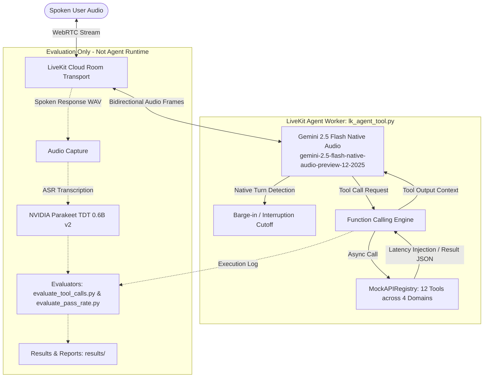

# Interruptible Real-Time Voice Agent — Samsung PRISM Gen AI Hackathon 3.0

> **Theme 05 — Interruptible Real-Time Agents**
> **Benchmark:** [Full-Duplex-Bench v3 (FDB-v3)](https://github.com/DanielLin94144/Full-Duplex-Bench) — multi-step tool calling under real-world speech disfluency
> 
> **Stack:** LiveKit Voice Agents SDK · Google Gemini 2.5 Flash Native Audio (end-to-end speech model)
> **Team:** MSRIT_Cache_Me · [AI usage disclosure](DISCLOSURE.md) · **Contact:** msrit.cache.me@example.com
> **Submission Tag:** `PRISM_GENAI_HACKATHON_Y2026`
> **Full Demo Video (with voiceover):** [`demo/out/final_submission_with_voice.mp4`](demo/out/final_submission_with_voice.mp4) (04:30 min, 1440x900 @ 30 fps)

<p align="center">
  
</p>

A low-latency, full-duplex conversational voice agent that understands spontaneous human speech (hesitations, filler words, self-corrections), supports immediate mid-utterance barge-in, and executes **multi-step tool calls** across four domains, all handled natively by a single realtime audio model.

---

## Table of Contents

1. [Why This Project](#1-why-this-project)
2. [Architecture](#2-architecture)
3. [Models & Providers](#3-models--providers)
4. [Setup & One-Command Run](#4-setup--one-command-run)
5. [Results](#5-results)
6. [Reproducibility](#6-reproducibility)
7. [Extension Demo: In-Car Voice Navigation Assistant](#7-extension-demo-in-car-voice-navigation-assistant)
8. [Known Limitations](#8-known-limitations)
9. [References](#9-references)
10. [Troubleshooting](#10-troubleshooting)
11. [Team](#team)

---

## 1. Why This Project

Real conversations are messy. Speakers pause mid-sentence, say "um", change their mind ("book to the mall, no wait, the office"), and interrupt the agent before it finishes. FDB-v3 measures exactly this: can a voice agent wait for the right moment, ignore disfluencies, and still fire the correct sequence of tool calls with correct arguments?

This submission takes a **fully native approach**. Instead of a cascaded STT → LLM → TTS pipeline (which serializes speech through rigid text transcripts and adds latency at every stage), a single end-to-end audio model, **Gemini 2.5 Flash Native Audio**, handles speech understanding, turn-taking, interruption, intent detection, function calling, and spoken responses in one model pass.

**Design principle:** the conversation should remain alive while the agent works.

### Where interruptible voice agents matter

| Domain | Why interruption & correction are essential |
|:---|:---|
| 🚗 **Driving** | Hands-free requests where users frequently interrupt or redirect |

*This is the intended use case, not a current production deployment.*

### What makes this approach different

1. **Native realtime:** no separate ASR → LLM → TTS cascade; one end-to-end audio model.
2. **Real tool interaction:** the agent doesn't stop at generating text; it calls tools.
3. **Disfluency-aware evaluation:** the benchmark contains false starts, self-corrections, disfluencies and interruptions.
4. **Measured, not assumed:** we instrument F1, precision, recall, strict pass rate, and latency.

The system is evaluated as an **interactive agent, not just a chatbot**.

| Design decision | Rationale |
|:---|:---|
| **Native realtime (Gemini Live) over cascaded pipeline** | ~4.25 s vs ~10.12 s published latency; no paid API key needed for the agent runtime; native disfluency handling (see [NOTES.md](NOTES.md), ARCH-001) |
| **LiveKit Cloud WebRTC transport** | Production-grade real-time audio, free tier, built-in room dispatch |
| **Exact-match evaluation available (no LLM judge)** | Reported baseline metrics reproducible **without any paid API key** |
| **Mock tool backends** | Deterministic, auditable tool behavior with configurable latency profiles |

---

## 2. Architecture



### Execution paths and interruption handling

- **Fast path (conversational response):** For direct queries that need no external data, the native audio model synthesizes spoken audio tokens in a single pass and streams them back over WebRTC with no tool overhead.
- **Slow path (tool execution):** When a query needs backend state (tracking an order, checking FX rates, modifying autopay), Gemini emits a structured function call. LiveKit's async dispatcher in [`Full-Duplex-Bench/v3/lk_agent_tool.py`](Full-Duplex-Bench/v3/lk_agent_tool.py) invokes the matching method on `MockAPIRegistry` in [`Full-Duplex-Bench/v3/mock_apis.py`](Full-Duplex-Bench/v3/mock_apis.py), with configurable simulated latency from [`latency_injector.py`](Full-Duplex-Bench/v3/latency_injector.py). The JSON result is returned to the model session, which speaks the answer.
- **Interruption handling:** Detection runs natively across the WebRTC stream and LiveKit `AgentSession`. When user speech is detected while the agent is speaking, outbound audio is halted immediately. *Note:* if an interruption lands mid-execution of a slow-path tool call, application-level cancellation and rollback of that backend call are **not** implemented (see [Known Limitations](#8-known-limitations)).

---

## 3. Models & Providers

| Component | Provider / Checkpoint | Role | Required Keys |
| :--- | :--- | :--- | :--- |
| **Realtime model** | Google `gemini-2.5-flash-native-audio-preview-12-2025` | End-to-end speech understanding, reasoning, tool selection, speech synthesis | `GOOGLE_API_KEY` |
| **Transport** | LiveKit Cloud WebRTC (`livekit-agents==1.8.3`) | Real-time audio streaming, room dispatch, session lifecycle | `LIVEKIT_URL`, `LIVEKIT_API_KEY`, `LIVEKIT_API_SECRET` |
| **Default voice** | `Puck` (configurable via `GOOGLE_VOICE`) | Spoken voice persona | None |
| **Evaluation ASR** | `nvidia/parakeet-tdt-0.6b-v2` | Transcribes recorded agent responses for scoring only (**not** in agent runtime) | None (public HuggingFace weights) |
| **LLM judge** | OpenAI `gpt-4o` | Semantic argument matching and response-quality scoring; enabled by default in the reproduction scripts, optional otherwise | `OPENAI_API_KEY` |

### Configuration (`.env`)

Place all credentials in a `.env` file at the repository root (template: [`.env.example`](.env.example)):

```dotenv
# LiveKit Cloud (free tier: https://cloud.livekit.io)
LIVEKIT_URL=wss://your-project.livekit.cloud
LIVEKIT_API_KEY=your_livekit_api_key
LIVEKIT_API_SECRET=your_livekit_api_secret

# Google AI Studio (https://aistudio.google.com)
GOOGLE_API_KEY=your_google_api_key

# Model selection & voice
LK_PROVIDER=gemini2_5
GOOGLE_VOICE=Puck

# Evaluation LLM judge (required unless you pass --no-llm-judge)
OPENAI_API_KEY=your_openai_key
```

Centralized parameters (provider, model name, voice, random seed, pinned FDB commit) live in [`agent_config.json`](agent_config.json) and are read dynamically by the agent.

---

## 4. Setup & One-Command Run

### Prerequisites

1. **Python 3.10, 3.11 or 3.12** (64-bit). The scripts auto-detect the newest version on `PATH`.
2. **FFmpeg** on your system `PATH` (for 48 kHz PCM transcoding).
3. Credentials for **LiveKit Cloud** and **Google AI Studio** (and **OpenAI** if using the LLM judge).

### What the reproduction scripts do

- Verify the Python version.
- Create an isolated virtual environment (`.venv`) and install pinned dependencies from [`requirements.txt`](requirements.txt).
- Validate that required credentials exist in `.env` (fails fast, never prints secrets).
- Verify or download the benchmark audio dataset (`fdb_v3_data_released/`).
- Start the agent worker in the background.
- Stream benchmark scenarios through WebRTC LiveKit rooms.
- Run the evaluators and write summaries and logs to `results/`.

### Windows (PowerShell)

```powershell
# 1. Clone and enter the repo
git clone https://github.com/AnanthAkshay/Samsung_Gen_AI.git
cd Samsung_Gen_AI

# 2. Configure credentials
cp .env.example .env
# Edit .env with your LIVEKIT_*, GOOGLE_API_KEY (and OPENAI_API_KEY) values

# 3. Run the full 100-scenario benchmark
.\reproduce.ps1

# (Optional) Quick 3-scenario smoke test
.\reproduce.ps1 -Limit 3

# (Optional) Exact-match only, no OpenAI key needed
.\reproduce.ps1 -Limit 3 -NoLlmJudge
```

### Linux / macOS (Bash)

```bash
# 1. Clone and enter the repo
git clone https://github.com/AnanthAkshay/Samsung_Gen_AI.git
cd Samsung_Gen_AI

# 2. Configure credentials
cp .env.example .env
# Edit .env with your LIVEKIT_*, GOOGLE_API_KEY (and OPENAI_API_KEY) values

# 3. Run the full 100-scenario benchmark
chmod +x reproduce.sh
./reproduce.sh

# (Optional) Quick 3-scenario smoke test
./reproduce.sh --limit 3

# (Optional) Exact-match only, no OpenAI key needed
./reproduce.sh --limit 3 --no-llm-judge
```

> Legacy wrappers [`scripts/run_eval.ps1`](scripts/run_eval.ps1) and [`scripts/run_eval.sh`](scripts/run_eval.sh) forward to the root scripts for backwards compatibility.

---

## 5. Results

Verified baseline on the full 100-scenario released FDB-v3 dataset. **Metrics are exact-match mode (no LLM judge).** Artifacts are preserved in [`results/baseline_final_20261001_020033/`](results/baseline_final_20261001_020033/). Organizers run evaluation with the LLM judge enabled (`--use-llm`, OpenAI `gpt-4o`).

| Metric | Verified Baseline (Exact-Match) | Notes |
| :--- | :---: | :--- |
| **Scenarios evaluated** | **100 / 100** | Full released dataset, 12 human speakers |
| **Strict pass rate** | **45.0%** (45 / 100) | Requires all expected tool calls with exact arguments |
| **Mean tool-selection F1** | **0.823** | Precision 0.835, recall 0.838 |
| **Mean argument accuracy** | **0.528** | Exact string match across invoked argument pairs |
| **Mean response latency** | **11.732 s** | End of user speech to first agent audio token (excludes 5 interruption cases) |
| **Turn-taking success rate** | **100.0%** (100 / 100) | Every scenario produced a non-silent spoken response |
| **Failures: wrong tools** | 34 | Disfluency caused wrong or missing tool invocation |
| **Failures: wrong arguments** | 21 | Correct tool, but argument format differed from ground truth |

### Domain breakdown (strict pass rate)

| Domain | Pass Rate | Fraction |
| :--- | :---: | :---: |
| **Finance & Billing** | **92.0%** | 23 / 25 |
| **E-Commerce Support** | **58.6%** | 17 / 29 |
| **Housing & Location** | **11.5%** | 3 / 26 |
| **Travel & Identity** | **10.0%** | 2 / 20 |

### Difficulty breakdown (strict pass rate)

| Difficulty | Pass Rate | Fraction |
| :--- | :---: | :---: |
| **Easy (1 tool call)** | **52.8%** | 19 / 36 |
| **Medium (2 tool calls)** | **41.2%** | 14 / 34 |
| **Hard (3 tool calls)** | **40.0%** | 12 / 30 |

*Disclaimer: official scoring is determined exclusively by the hackathon organizers' independent evaluation runs.*

---

## 6. Reproducibility

### Determinism and variance

- **Local RNG fixed:** `seed=42` in [`agent_config.json`](agent_config.json) seeds Python `random`, NumPy and PyTorch for local evaluation scripts and mock-API latency injection.
- **Gemini Live is non-deterministic:** the realtime audio model exposes no temperature or seed control, so spoken responses and argument formatting vary across runs. Expect the strict pass rate to fluctuate by roughly ±3–5% run to run.
- **Expected runtime:** a full 100-scenario run takes about **2 hours**, since audio streams in real time (user speech, agent processing, simulated tool latency, and room teardown for each scenario). Use `--limit N` for faster smoke tests.

### LLM judge (organizer configuration)

The reproduction scripts **enable the LLM judge by default** (`--use-llm` passed to `evaluate_tool_calls.py` and `evaluate_pass_rate.py`) to match the organizer procedure.

- **Judge model:** OpenAI `gpt-4o` (pinned in `Full-Duplex-Bench/v3/evaluate_tool_calls.py` and `evaluate_pass_rate.py`)
- **Required key:** `OPENAI_API_KEY` in `.env`
- **Purpose:** semantic argument matching (e.g. `2026-08-20` vs "August twentieth, two thousand twenty-six") and response-quality scoring
- **Opt-out:** `./reproduce.sh --limit 3 --no-llm-judge` (exact-match only)
- **Approximate cost:** about $0.15–$1.00 USD per 100 scenarios, depending on OpenAI tier and transcript length

When the judge is enabled, results are saved in both modes:

- `summary_exact_match.json`: string-level exact match (no API key needed)
- `summary_llm_judge.json`: semantic match via `gpt-4o` (needs `OPENAI_API_KEY`)

A side-by-side comparison is written to `results/<run_id>/score_comparison_table.txt`.

### API quota requirements

- **Google AI Studio free tier** has strict rate limits (about 15 requests/minute, 1,500/day). A full 100-scenario run will exceed the daily quota and stall. A paid tier (pay-as-you-go) with enough streaming-session quota is recommended.
- **Resume support:** if a run is interrupted (Ctrl+C, rate limit, network error), re-run the same command. Scenarios that already have a `result_*.json` are skipped unless you pass `--force`.

```bash
./reproduce.sh            # resumes where it stopped
./reproduce.sh --force    # overwrites existing results
```

### Python and platform support

- **Python:** 3.10, 3.11 or 3.12. On Python 3.10 only, `backports.tarfile==1.2.0` is installed to work around NeMo's `tarfile.extract(filter=)` incompatibility.
- **Tested:** Windows 11 + Python 3.10.11 + CUDA 12.8 (development machine, verified). Ubuntu 22.04 + Python 3.11 + CPU (not verified on this machine).
- **Linux:** `reproduce.sh` targets Ubuntu 22.04/24.04. Required system packages: `git`, `ffmpeg`, `libsndfile1`, `python3-venv`, `python3-pip` (the script checks and fails with clear instructions if any are missing).
- **Windows:** `reproduce.ps1` targets Windows 10/11 with PowerShell 5.1+ and FFmpeg on `PATH` (`winget install Gyan.FFmpeg`).
- **GPU:** an NVIDIA GPU (48 GB VRAM recommended) is used **only** for local NeMo Parakeet ASR during evaluation post-processing. The Gemini Live agent runs on Google's hosted API and needs no local GPU. CPU fallback works but is slower and may run out of memory on machines with under 16 GB RAM.
- **Torch CUDA:** `scripts/install_deps.py` installs `torch==2.14.0` from `https://download.pytorch.org/whl/cu128` (CUDA 12.8 wheels, compatible with CUDA 12.x and 13.x hosts) and falls back to CPU-only torch when `nvidia-smi` is absent.

### Benchmark pinning and data

- **Upstream commit:** `3e799c45a045256f47d5f1c9cda90157e2d2ec9e` (declared in `agent_config.json`).
- **Vendored code:** `Full-Duplex-Bench/v3/` is committed directly into this repo (not a submodule). Our edits to `lk_agent_tool.py` and `run_tool_benchmark_all_released.py` are already applied.
- **Audio dataset:** `fdb_v3_data_released/` (~8 GB) is **not tracked in git** (`.gitignore` excludes `*.wav` and `*.zip`). The reproduction script downloads it via `gdown` from Google Drive (ID `1SO_4MTazWQ_jvCx0dtmpQ-t40bdd07yz`). If the download fails (Drive quota, network), the script prints manual instructions.

### Fresh-clone verification

```bash
git clone https://github.com/AnanthAkshay/Samsung_Gen_AI.git
cd Samsung_Gen_AI
cp .env.example .env            # edit with your keys; never commit .env
./reproduce.sh --limit 3        # smoke test with the LLM judge
./reproduce.sh --limit 3 --no-llm-judge   # offline smoke test, no OpenAI key

# Expected: results/baseline_<timestamp>/ with summary_exact_match.json
# (and summary_llm_judge.json when the judge is enabled)

git status                      # should show .env as untracked at most
grep -rE "AIza|sk-|LIVEKIT_API_SECRET=.{10}" . --exclude-dir=.git --exclude="*.example" || echo "No secrets found"
```

### Known non-reproducible elements

1. **Gemini Live token-level variance:** spoken audio and argument formatting are not deterministic for identical input.
2. **ASR transcription:** Parakeet shows minor punctuation/capitalization differences across hardware (GPU vs CPU, CUDA versions).
3. **WebRTC jitter:** network conditions and server load add under 100 ms of variance to frame timestamps.
4. **LLM judge:** `gpt-4o` scoring is itself non-deterministic.

These are acceptable under FDB-v3 methodology; organizers average across runs or use significance tests.

---

## 7. Extension Demo: In-Car Voice Navigation Assistant

The extension applies the same LiveKit + Gemini Realtime stack to an automotive in-cabin assistant, where drivers frequently self-correct mid-sentence. It is implemented in [`extension_demo.py`](extension_demo.py) and verified by the offline test suite [`tests/test_extension_tools.py`](tests/test_extension_tools.py).

**Tools**

| Tool | Behavior |
|:---|:---|
| `navigate_to(destination)` | Activates turn-by-turn navigation state and logs the destination |
| `cancel_navigation()` | Clears active navigation state and records the cancellation |
| `get_eta()` | Reports the ETA if navigation is active; otherwise returns "There is no active navigation" |

**Auditable logging:** every tool call appends an event line to [`logs/extension_tool_calls.log`](logs/extension_tool_calls.log).

**Offline unit tests** (no network or LiveKit connection required):

```bash
python tests/test_extension_tools.py
```

---

## 8. Known Limitations

In the interest of full technical transparency, these are verified in the current codebase:

1. **No application-level rollback or stale-call abort:** WebRTC audio cutoff halts speech immediately on interruption, but background tool calls dispatched to `MockAPIRegistry` have no transactional abort or rollback.
2. **Argument formatting discrepancies:** mean argument accuracy (0.528) trails tool-selection F1 (0.823). The 21 argument mismatches come mainly from date formatting (`2026-08-20` vs spoken variants) and alphanumeric spelling (`ABC123` vs `A B C 1 2 3`).
3. **No idempotency or confirmation layer:** mock API calls run directly on model dispatch, with no idempotency cache or safety-confirmation gate.
4. **Event-loop load sensitivity:** during sustained multi-room batch runs, synchronous crypto and ASR operations can trigger asyncio loop-stall warnings, raising mean response latency to about 11.7 s.

---

## 9. References

1. Lin, G.-T., Chen, C., Chen, Z., & Lee, H.-y. *Full-Duplex-Bench-v3: Benchmarking Tool Use for Full-Duplex Voice Agents Under Real-World Disfluency*. arXiv:2604.04847 (2026).
2. Lin, G.-T., et al. *Full-Duplex-Bench (v3)*. https://github.com/DanielLin94144/Full-Duplex-Bench
3. LiveKit. *LiveKit Agents: Real-time multimodal AI framework*. https://github.com/livekit/agents (`livekit-agents==1.8.3`)
4. Google DeepMind. *Gemini 2.5 Flash Native Audio* (`gemini-2.5-flash-native-audio-preview-12-2025`). https://ai.google.dev/gemini-api/docs/live
5. NVIDIA NeMo. *parakeet-tdt-0.6b-v2*. https://huggingface.co/nvidia/parakeet-tdt-0.6b-v2
6. Silero Team. *Silero VAD* (comparative baseline reference). https://github.com/snakers4/silero-vad

---

## 10. Troubleshooting

| Issue / Error | Root Cause | Resolution |
| :--- | :--- | :--- |
| `UnicodeEncodeError: 'charmap' codec can't encode...` | Windows console defaults to the legacy CP1252 codepage | Both reproduction scripts export `PYTHONUTF8=1` and `PYTHONIOENCODING=utf-8` automatically |
| `FileNotFoundError: /tmp/agent_heartbeat.log` | Hardcoded `/tmp/` path fails on Windows when `C:\tmp` doesn't exist | [`lk_agent_tool.py`](Full-Duplex-Bench/v3/lk_agent_tool.py) creates the directory on startup; `reproduce.ps1` initializes `C:\tmp` |
| `worker is at full capacity, marking as unavailable` | LiveKit `AgentServer` defaults to a 0.70 load threshold and rejects new rooms during CPU spikes | `lk_agent_tool.py` sets `load_threshold=0.95` |
| `ffmpeg: The term 'ffmpeg' is not recognized` | FFmpeg missing from `PATH` | `winget install Gyan.FFmpeg` (Windows), `apt install ffmpeg` (Linux) or `brew install ffmpeg` (macOS) |
| `TarFile.extract() got an unexpected keyword argument 'filter'` | Python 3.10's `tarfile` lacks `filter="data"` | `backports.tarfile==1.2.0` is pinned in [`requirements.txt`](requirements.txt) |
| Agent fails to accept incoming rooms | Multiple agent workers registered under the same LiveKit project credentials | Keep only **one** worker active per project; stop any running `lk_agent_tool.py` or `extension_demo.py` |

---

## Team

<p align="center">
  <b>Team Cache_Me · MSRIT</b><br/>
  Akshay A &nbsp;·&nbsp; Aaditya V &nbsp;·&nbsp; H M Pranav &nbsp;·&nbsp; Tejas M
</p>

<p align="center">
  <sub>Built for the Samsung PRISM Gen AI Hackathon 3.0 · Theme 05: Interruptible Real-Time Agents · <code>PRISM_GENAI_HACKATHON_Y2026</code></sub>
</p>
